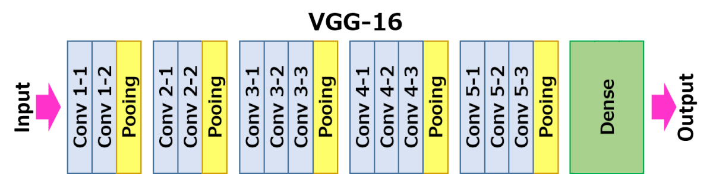
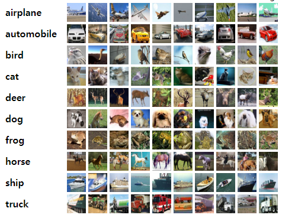

# Assignment6 : VGG with CPU and CUDA


## 1. Related Things

### 1-1 VGG16 Architectures

There are 13 convolution layers and 4 max-pooling layers. Then one fully connected layer are applied. You will implement these layers in CUDA version.



### 1-2 CIFAR 10

The CIFAR-10 dataset consists of 60000 32x32 colour images in 10 classes, with 6000 images per class. You will use 10000 test images to inference the class of image.



## 2. Explanation about the structure of skeleton code

```bash
user@acsys:/HW6/CUDA_VGG$ tree .
.
├── build                         # objective file will be there
│                                 
├── image                         # Images used by README.md
│   ├── cifar10_samples.PNG       # CIFAR-10 samples
│   ├── vgg16.PNG				  # VGG16-architecture
│   └── LeNet5-architecture.jpg   # LeNet5-architecture 
├── Makefile                      # Makefile
├── model                         # Provided pre-trained model
│   └── main_vgg.py               # Used code to train
│                                 # test accuracy 81%
├── README.md                     # What you are reading :3
├── src                           # Source Code
    ├── common.h                  # Common
    ├── vgg16.h                   # Base VGG16
    ├── vgg16.cpp
    ├── vgg16_cpu.h               # CPU VGG16
    ├── vgg16_cpu.cpp
    ├── vgg16_cuda.h              # CUDA VGG16
    ├── vgg16_cuda.cu
    ├── main.cpp                  # main program
    ├── util.h                    # Util
    └── util.cpp

4 directories, 15 files
```

## 3. Implementation in CUDA

### Normalization

### Padding

### 2D Convolution

### ReLU

### Max Pooling

### Fully Connected Layer